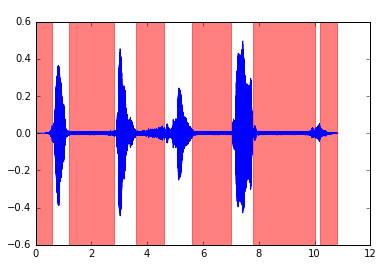
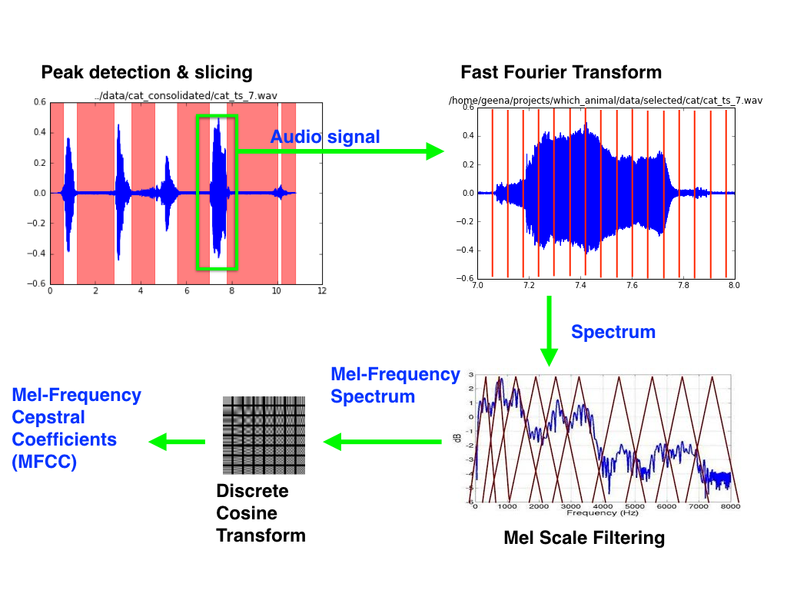
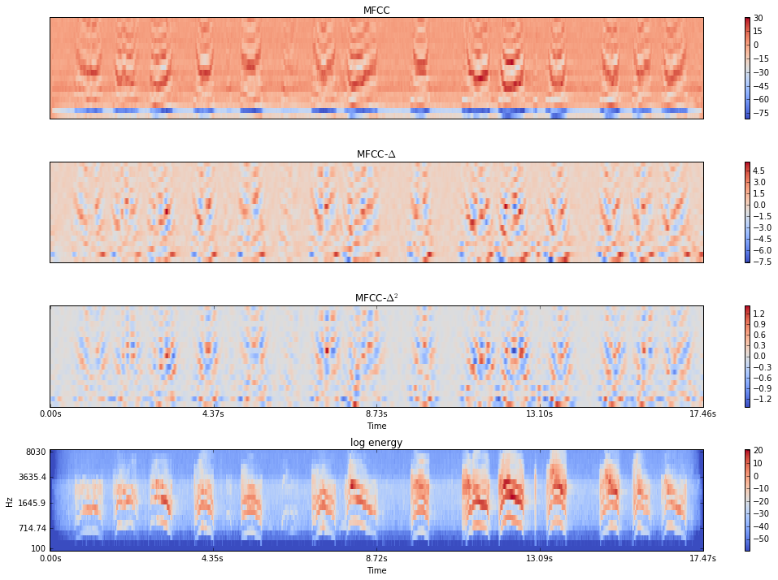

# which_animal

This project is about animal sound recognition using convolutional neural network. Convolutional neural network has been a popular tool in image recognition but recently has been implemented also in human speech recognition. Using image features from sound data is done by creating a collection of spectrum in a short time scale.

 Mel frequency cepstrum is a short-term power spectrum of a sound which represent a logarithmic energy in each frequency band in non-linear Mel scale to approximate the human auditory system's respond to a sound. The amplitudes of the envelops of the power spectrum are the coefficients called Mel-frequency cepstral coefficients (MFCCs) and are one of the most popular feature extraction methods in speech recognition.

## Data Collection and Cleaning
I scraped data from the two websites below:
1. [TierstimmenArchiv](http://www.tierstimmenarchiv.de/webinterface/contents/treebrowser.php) : an animal sound research archive in Germany
2. [Freesound.org](https://www.freesound.org) : a crowd-sourced database on sounds and sound effects

Tierstimmenachiv is an animal sound database for researchers. They have sound data from variety of animals including birds, domestic mammals, wild mammals, amphibians, reptiles, and more. I chose cats and dogs because I thought they would be fun, but later I realized that cat and dog sound data is hard to find as opposed to bird sound data which outnumbers all other animal sounds because of ornithology.  I scraped data using Selenium and Requests, and got 50 files for cat sounds, 120 files for dog sounds. over 1200 files for 'finch' alone in birds categories after filtering blank pdf files they had in the data download links.   

Since the cat data from Tierstimmen was not enough I scraped more files from freesound.org website. Freesound had over 300 listings for the search keyword 'meow'. However the quality of the data was not as good as Tierstimmen, since it had many mis-categorized data such as human voice recordings imitating a cat sound or sound effects that are mixed with cat sounds. I wrote a script to parse texts from title, description, and tags of the listings and applied word filtering to get rid of those wrong files, then I manually corrected some of the tags for data from Freesound. Tierstimmen also has sound descriptions written in German, so I wrote a script to extract and translate the sound keywords.

Then I used Pandas, matplotlib, ipython widgets, IPython display and Audio for further data cleaning and data exploration process. I categorized cat sounds by 'meow', 'purr', 'yowl', 'hiss', and 'other'. For hiss sound, often times it had other noise from cat fighting or a human interaction from teasing the cat such as hitting object. Also sometimes there were cats punching on the microphone, making really loud unwanted noise. So 'hiss' and 'other' was dropped from the dataset. The files with background noise were kept in the data unless noise exceeds cat sounds.

For dogs, there were many different sounds subcategories recorded as description. I grouped similar sounds together into 'bark', 'howl', 'whimper', and 'other', where 'other' includes 'group howl', 'cackle', 'growl', and 'panting'. Those categories were kept but 'licking' and 'snoring' sounds were dropped as they are not useful.    

For birds, many had large white noise background since the field recording usually happens outdoor from far distances. After applying a pick detection script to filter out files with large background noise, about 500 files were kept.

My pick detection script uses a simple algorithm that it detects peaks by selecting time windows with energy density (the sum of amplitude squared with in a time window of 0.2 second) more than 4% of the average energy density of the full length of the audio signal in the file. The threshold choice of 4% seemed to work well for all animal types and sound sub categories of each animal.  
  
<b>Figure 1: </b> Peak detection of 'meow' sounds.       

## Feature Extraction
I used Mel-frequency cepstral coefficients (MFCCs) as a feature extraction method.

  
<b>Figure 2: </b> MFCCs calculation process      
    
<b>Figure 3: </b> MFCCs and delta, delta-delta, and mel-spectrum for 'meow' sound.     

## Models

## Results

## Reference & Resource

### References
1. Matthias Zeppelzauer, Discrimination and retrieval of animal sounds. Technischen Universit ̈at Wien, Thesis (2005).
Take-away: MFCC performs the best among various sound featurization techniques. First 7 MFCCs suffice to have 70+% recall and precision for cats, dogs, birds, and cows classification. Each category had around 100 sound file data. Analysis done in knn, svm, etc, but have not  been tried in neural network.  

2. Ossama Abdel-Hamid et. al., Convolutional Neural Networks for Speech Recognition., EEE/ACM Transactions on Audio, Speech, and Language Processing, Vol 22 (10), pp 1533-1545 (2014)

3. Sergey Ioffe & Christian Szegedy, Batch normalization: Accelerating deep network training by reducing internal covariate shift., arXiv:1502.03167 (2015)

4. Nitish Srivastava et.al., Dropout: a simple way to prevent neural networks from overfitting., Journal of Machine Learning Research, Vol. 15 (1), pp.1929-1958 (2014)

5. Xavier Clorot & Yoshua Bengio, Understanding the difficulty of training deep feedforward neural networks. JMLR Proceedings of AISTATS, Vol. 9, pp.249-256 (2010)

6. [Stanford CS231n resources](http://cs231n.github.io/)

7. Michael Lutter, [Mel Frequency Cepstral Coefficients](http://recognize-speech.com/feature-extraction/mfcc#)., SR Wiki  (web)
8. Blog post, [Mel Frequency Cepstral Coefficients Tutorial](http://practicalcryptography.com/miscellaneous/machine-learning/guide-mel-frequency-cepstral-coefficients-mfccs/), Practical cryptography (web)

### Useful tools
- [DSP python tools](https://github.com/AllenDowney/ThinkDSP) : Signal processing tools. I used it for sound data exploration.
- [librosa package](https://github.com/librosa/librosa) : Sound processing and featurization tools. I used it to calculate mfcc, delta, and delta2.
- [ffmpeg](https://ffmpeg.org/) : Converts audio/video file formats. I also used it for down-sampling audio signals.
- [mp3fy](www.mp3fy.com) : Youtube video to audio converter. Works well even with hours-long videos.  
