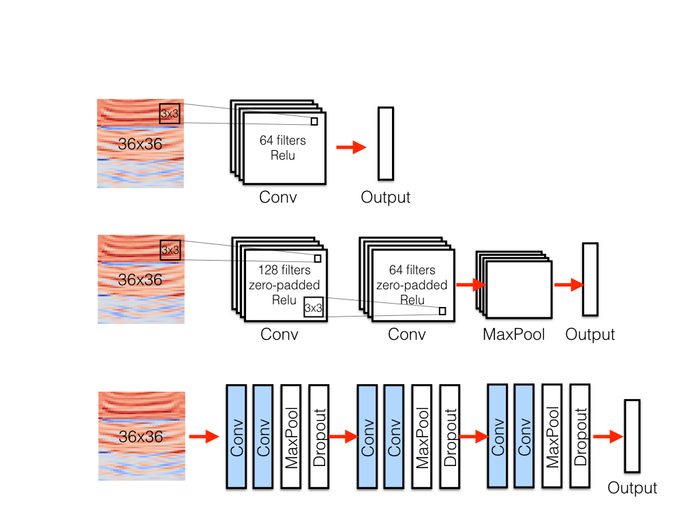
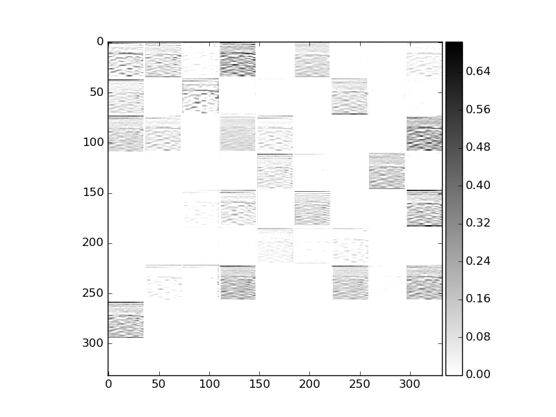

# which_animal

This project is about animal sound recognition using convolutional neural network. Convolutional neural network has been a popular tool in image recognition but recently has been implemented also in human speech recognition. Extracting features in an image form from sound data is done by creating a collection of spectrum in a short time scale.
Mel frequency cepstrum is a short-term power spectrum of a sound which represent a logarithmic energy in each frequency band in non-linear Mel scale to approximate the human auditory system's respond to a sound. The amplitudes of the envelops of the power spectrum are the coefficients called Mel-frequency cepstral coefficients (MFCCs) and are one of the most popular feature extraction methods in speech recognition. I was motivated by two works <sup>[1,2](#references)</sup>

## Data Collection and Cleaning
I scraped data from the two websites below:    
1. [TierstimmenArchiv](http://www.tierstimmenarchiv.de/webinterface/contents/treebrowser.php) : an animal sound research archive in Germany   
2. [Freesound.org](https://www.freesound.org) : a crowd-sourced database on sounds and sound effects   

Tierstimmenachiv is an animal sound database for researchers. They have sound data from variety of animals including birds, domestic mammals, wild mammals, amphibians, reptiles, and more. I chose cats and dogs because I thought they would be fun, but later I realized that cat and dog sound data is hard to find as opposed to bird sound data which outnumbers all other animal sounds because of data demand from ornithologists.  I scraped data using Selenium and Requests, and got 50 files for cat sounds, 120 files for dog sounds. over 1200 files for 'finch' alone in bird categories after filtering blank pdf files they had in the data download links.   

Since the cat data from Tierstimmen was not enough I scraped more files from freesound.org website. Freesound had over 300 listings for the search keyword 'meow'. However the quality of the data was not as good as Tierstimmen, since it had many mis-categorized data such as human voice recordings imitating a cat sound or sound effects that are mixed with cat sounds. I wrote a script to parse texts from title, description, and tags of the listings and applied word filtering to get rid of those unwanted files, then I manually corrected some of the tags for data from Freesound. Tierstimmen also has sound descriptions written in German, so I wrote a script to extract and translate the sound keywords.

Then I used Pandas, matplotlib, ipython widgets, IPython display and Audio for further data cleaning and data exploration process. I categorized cat sounds by 'meow', 'purr', 'yowl', 'hiss', and 'other'. For hiss sound, often times it had other noise from cat fighting or a human teasing the cat by hitting object to make the cat hiss. Also sometimes there were cats punching on the microphone, making really loud unwanted noise. So 'hiss' and 'other' were dropped from the dataset. The files with background noise were kept in the data unless the noise exceeds cat sounds.

For dogs, there were many different sounds subcategories in descriptions. I grouped similar sounds together into a few groups: 'bark', 'howl', 'whimper', and 'other', where 'other' includes 'group-howl', 'cackle', 'growl', and 'panting'. Those categories were kept but 'licking' and 'snoring' sounds were dropped as they are not useful.    

For birds, many had large white noise background since the field recording often happens outdoor and from far distances. After applying a pick detection script to filter out files with large background noise, about 500 files were kept.

My peak detection script uses a simple algorithm that it detects peaks by selecting time windows with energy density (the sum of amplitude squared with in a time window of 0.2 second) more than 4% of the average energy density of the full length of the audio signal in the file. The threshold choice of 4% seemed to work well for all animal types and sound sub categories of each animal.  
  
<sub><b>Figure 1: </b> Peak detection of 'meow' sounds.  </sub>     

## Feature Extraction
I used Mel-frequency cepstral coefficients (MFCCs) as a feature extraction method. As shown in Fig.1, MFCC is calculated by     
1. Slicing the audio signal into short time interval and taking a short-term fast Fourier transform (STFT); in a human speech recognition 20-40 ms time interval is common but I used 50 ms time interval with 50% overlap (25 ms slide).  
2. Getting Mel-frequency spectrum by filtering the STFT result with triangular-shaped band-pass filters. Mel filters mimics how human auditory system responds to different frequencies (log-scale rather than linear scale), and can be calculated by ```M(f) = 1125 * ln(1+f/700)```. In the resulting Mel-frequency spectrum, the values represent the energy in the frequency range in Mel-scale; usually logarithm of the energy is more useful as human perceived loudness in a log scale.     
3. Extracting cepstral coefficients by taking discrete cosine transform. Discrete cosine transform gives information about how strong each envelop is in the frequency domain. It gives more global view of the sound spectrum rather than source-dependent high harmonics. However, some researchers believe that it ruins locality of information, and suggest to use log-energy of the Mel-spectrum instead of the cepstral coefficients from discrete cosine transform <sup>[2](#references)</sup>.

  
<sub><b>Figure 2: </b> MFCCs calculation process </sub>    

Figure 3. shows calculated MFCCs and their first and second time derivatives delta and delta-delta (top 3 rows). The x-axis is the time interval (50 ms) and the y-axis is the index of the cepstral coefficients, and the coefficient values are represented by an arbitrary color scaling for visualization. The bottom row is a Mel-frequency spectrum with frequency range as y-axis and log-energy as color scaling. The V-shaped patterns happen when there is a 'meow' sound. Note that the image is for demo and is a full length audio (17.5 s) rather than 1 second slice. To make the input images, 1 second slice of a normalized audio signal is taken at each peak detected by a method described above, then MFCCs and time derivatives are calculated using librosa sound processing package, then the three arrays are concatenated into one square-shape array to form an image. Each pixel values are between plus minus a few tens to hundreds for MFCCs and several tens for time derivatives. The arrays are further re-scaled and it is very important to properly scaling  those to run neural networks (I'll discuss it in the following section).
    
<sub><b>Figure 3: </b> MFCCs and delta, delta-delta, and mel-spectrum for 'meow' sound. </sub>    

## Convolutional Neural Network Models and Results
There are various deep neural network models available for image recognition tasks such as VGGNet, and even weights of those models pre-trained on large image dataset are available. However, for animal sound there is no such examples readily available. Since the features in the sound spectrum are not very complicated shape like an image of an animal, I focused on modeling simple deep convolutional neural networks with relatively fewer layers and exploring how each hyper-parameters and additional layers play roles.  
I used Keras with GPU-enabled TensorFlow backend for modeling and training. I started with a single 2d convolutional layer with no drop outs or pooling layer. At first, the neural net did not learn and predicted all zeros (label for dogs). It turns out that the input image was not properly scaled because there were large outlier pixel values in the first coefficient values for MFCCs (bottom row of each MFCCs and deltas array) which represents DC term or overall loudness and is not so informative anyway; therefore those DC terms have been removed and each array (MFCCs and deltas) has been re-scaled separately then concatenated into one. I also trimmed time-axis to make it a square shape, so the resulting array shape is 36 x 36 x 1 (13 minus one MFCCs and their time derivatives). Once the outlier pixels got removed and images are re-scaled, the single-layer model worked to produce some numbers, then other hyper parameters were tuned which gave nearly 80-82% accuracy and precision when using balanced data and cross-validation. I tested an effect of filter size and filter shape (vertical and horizontal convolution along frequency or time axis) and confirmed that changing nb_row doesn't affect but increasing nb-col makes it worse which suggests that the feature variation in time axis is more important.

  
<sub><b>Figure 4: </b> Three models - single layer, double layer, and 6-layer convolutional neural network model. </sub>     

For the next simplest model, I used two convolutional layers and one max pool layer, since repeated form of this unit structure is popular in image recognition models such as VGGNet which uses multiple repetition of Conv-Conv-MaxPool or Conv-Conv-Conv-MaxPool patterns. So, the one stack of conv-conv-maxpool layers can be thought to be the simplest form of the repeated structure in VGGNet. All convolutional layers are zero-padded so that it keeps the image size, and have Relu activation. The first conv. layer had 128 filters and the second one has 64 filters. The double layer model needed more tweaking in learning rate and other optimization hyper-parameters to make train error not diverge, but indeed achieved higher accuracy and precision 83-86%.

For the next model, I used three repeated units of conv-conv-maxpool which has total 6 convolution layers, all zero-padded and with Relu activations. Different from previous models, I added a dropout layer after each unit for regularization. It was a lot more sensitive than simpler model in a sense that it was much harder to tweak hyper parameters to make the training error or loss function (cross-categorical entropy) to converge; learning rate and decay rate were not enough to solve the diverging loss function. To cure diverging loss problem, I applied Glorot_normal initialization to some of the layers. It is a normal distribution with a scaling (standard deviation) proportional to 1/sqrt(n_in+n_out), where n_in and n_out are number of neurons fed into the weights and number of neurons that result out from the weights.
Applying Glorot_normal initialization to Dense layer at the end showed decreasing loss at first and at some point it blew up again. Adding Glorot init to the first convolutional layer as well finally made the net work. Adding droupouts helped avoid overfitting and better perform. The 6-layer model achieved 87-90% accuracy and precision.

|class|precision |   recall | f1-score |  support|
|-----------|---------|----------|----------|------|
|0  |     0.85  |    0.88    |  0.86   |    192|
|1  |     0.83  |    0.94   |   0.89   |    196|
|2  |     0.99  |    0.84   |   0.91    |   212|
|avg / total  |     0.90   |   0.89   |   0.89  |     600|

<sub><b>Table 1: </b> A sample result from 6-layer model on a balanced data. Cross-validated with 20% validation set.  </sub>     

Just for fun, I visualized the output from intermediate layers such as convolutional layers and dropout layers to see if there is an interesting pattern to my eyes. Since it was a features extracted from sound data, the visual representation didn't mean much to human eyes, but I was able to see the net catches some wrinkle-like features from the images.
  
<sub><b>Figure 5: </b> Intermediate layers representation. Order: Conv1, Conv2, Dropout1, Conv3, Conv4, Droupout2, Conv5, Conv6, Droupout 3.</sub>   

## Summary
In this project, I extracted image features from animal sound data using Mel-frequency cepstral coefficients (MFCCs) and classified the animal sounds using convolutional neural networks. I tested three simple models with one, two and six convolutional layers and explored the effect of different factors on the model stability (convergence of the loss function) and the model performance (accuracy and precision). As a result, it turned out that image pre-processing and scaling, learning rate, and initialization of the CNN are crucial for the model to work (loss function convergence) and to avoid overfitting. Learning rate, SGD decay rate, regularization (dropouts), batch number and number of epoch are important to avoid overfitting. With all of above plus other hyperparameters such as number of filters and filter size, and overall model structure also played an important role in model performance.

There are many possible future work that can be built on top of this project. I can try improving the model by exploring other featurization method such as mel-frequency spectrum's log-energy values without discrete cosine transform to see if the localized features really helps. I could add more animals (perhaps birds because of their abundance of sound data). Or I could try other types of models such as recurrent neural networks (RNN).


## References
1. Matthias Zeppelzauer, Discrimination and retrieval of animal sounds. Technischen Universit ̈at Wien, Thesis (2005).
Take-away: MFCC performs the best among various sound featurization techniques. First 7 MFCCs suffice to have 70+% recall and precision for cats, dogs, birds, and cows classification. Each category had around 100 sound file data. Analysis done in knn, svm, etc, but have not  been tried in neural network.  

2. Ossama Abdel-Hamid et. al., Convolutional Neural Networks for Speech Recognition., EEE/ACM Transactions on Audio, Speech, and Language Processing, Vol 22 (10), pp 1533-1545 (2014)

3. Sergey Ioffe & Christian Szegedy, Batch normalization: Accelerating deep network training by reducing internal covariate shift., arXiv:1502.03167 (2015)

4. Nitish Srivastava et.al., Dropout: a simple way to prevent neural networks from overfitting., Journal of Machine Learning Research, Vol. 15 (1), pp.1929-1958 (2014)

5. Xavier Glorot & Yoshua Bengio, Understanding the difficulty of training deep feedforward neural networks. JMLR Proceedings of AISTATS, Vol. 9, pp.249-256 (2010)

6. [Stanford CS231n resources](http://cs231n.github.io/)

7. Michael Lutter, [Mel Frequency Cepstral Coefficients](http://recognize-speech.com/feature-extraction/mfcc#)., SR Wiki  (web)
8. Blog post, [Mel Frequency Cepstral Coefficients Tutorial](http://practicalcryptography.com/miscellaneous/machine-learning/guide-mel-frequency-cepstral-coefficients-mfccs/), Practical cryptography (web)

### Useful tools
- [DSP python tools](https://github.com/AllenDowney/ThinkDSP) : Signal processing tools. I used it for sound data exploration.
- [librosa package](https://github.com/librosa/librosa) : Sound processing and featurization tools. I used it to calculate mfcc, delta, and delta2.
- [ffmpeg](https://ffmpeg.org/) : Converts audio/video file formats. I also used it for down-sampling audio signals.
- [mp3fy](www.mp3fy.com) : Youtube video to audio converter. Works well even with hours-long videos.  
